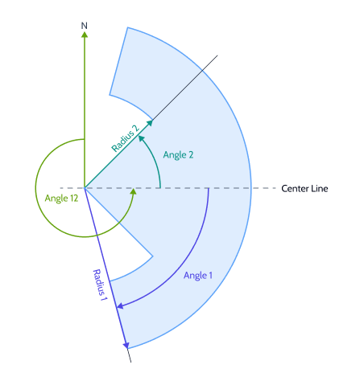

# SeeYou Task QR Code specification

*Copyright © 2024, Naviter d.o.o. All Rights Reserved. Version 2.2*

The Task QR Code format is used to share tasks between devices equipped with a QR Code scanner or a camera. This file format was originally developed by XCTrack for use in their software. This document extends the version 2 format: [XCTrack V2 format](https://xctrack.org/Competition_Interfaces.html). Ideally, the extensions described in this document would become part of the original file format specification. As this has not happened for too long, this document describes Naviter extensions for use in SeeYou Navigator, Oudie N and Omni are described in this document.

Naviter extensions allow all sports and all task types to be supported by this specification. Not least, Hike and Fly for paragliding and Assigned Area Tasks for gliding are part of the extensions in this specification.


## Conceptual Structure

The conceptual structure of the object is shown below with details given later in the document:

```
XCTSK:{
  "taskType": "CLASSIC",  Task Type             String            Required
  "version": 2,           XCTrack Version       Integer           Required
  "t": [                  Turnpoints            List of Objects   Required
    {                     Turnpoint Object      Object            Required
      "z":                Definition            String            Required
      "n":                Name                  String            Required
      "d":                Description           String            Optional
      "t":                Type                  Number            Optional
      "o": {              Options               Object            Optional
        "a1":             Angle 1               Float             Optional
        "a2":             Angle 2               Float             Optional
        "a12":            Direction             Float             Optional
        "r2":             Inner Radius          Integer           Optional
        "l":              Line Flag             Bool Integer      Optional
    },
    ...
  ],
  "s": {                  Start Object          Object            Optional
    "g": [...]            Gates                 Array of Strings  Required
    "t":                  Type                  Integer           Required
    "d":                  Direction             Integer           Optional
  },        
  "g": {                  Goal Object           Object            Optional
    "d":                  Task Deadline         String            Optional
    "t":                  Sector Shape          Integer           Optional
  },
  "o": {                  Task Options          Object            Optional
    "v": 2                SeeYou Version        Integer           Required
    "fa":                 Finish Altitude (MSL) Integer           Optional  
    "hf":                 Hike & Fly Flag       Bool Integer      Optional
    "tt":                 Task Duration         Integer           Optional
    "bgi":                Before Gate Interval  Integer           Optional
    "gi":                 Gate Interval         Integer           Optional
  },
  "e":                    Geodetic System       Integer           Optional
}
```

**Encoding**: UTF-8

## Units

- **Coordinates:** Google's [Encoded Polyline Algorithm Format](https://developers.google.com/maps/documentation/utilities/polylinealgorithm) (string), example: `uxyzlO_}zj}DwnCg^`
- **Altitudes and Elevations:** Meters (integer), example: `1500`
- **Time:** UTC Time formatted as `"H:MM:SSZ"`, example: `"1:30:00Z"`
- **Duration and Intervals:** Duration in seconds (integer), example `3600` 
- **Angles:** Decimal Degrees (float), example: `45.73645`
- **Boolean Values** Are represented as an integer `1` (True) or `0`  false.


## Object and Property descriptions

### Task Type 

In the original specification only one type is available ("CLASSIC"). Naviter doesn't extend this field. Task type definitions are stored elsewhere as described below.

### Turpoint Object

Each task turnpoint must be represented in the list of turnpoints with a turnpoint object. The turnpoint properties `"z", "n", "d", "t"` are specified by XCTrack and the options `"o"`  object is a Naviter specific extension.

##### Turnpoint location `z`

Turnpoint specification is a string that encodes *4 different values*: turpoint center coordinates longitude and latitude as well as the turnpoint altitude and cylinder radius. The four values are fed into the Google's [Encoded Polyline Algorithm Format](https://developers.google.com/maps/documentation/utilities/polylinealgorithm) to produce the encoded string.

Example:

```
lon   lat.  alt  r  
48.12 17.42 2300 500 -> "uxyzlO_}zj}DwnCg^"
```

##### Type `t`

Optional numerical property that defines if the turnpoint is a Start of Speed Section (SSS): `2` or an End of Speed Section (ESS): `3`. 

##### Options `o`

*This is an Extension of the original format.*

This extension allows you to define turnpoint sector shapes that are not circles. Such shapes are often used in gliding to describe Assigned Area turnpoints. With this extension it is possible to define an FAI sector, semicircle, a pie-slice, keyhole and many other shapes.

This schematic shows all the parameters available to define the shape of the turnpoint sector:


| Name  | Description                                                  | Data Type    |
| ----- | ------------------------------------------------------------ | ------------ |
| `a1`  | Angle 1 is half the width of the sector in degrees relative to the center line. 45 defines a right angle. | float     |
| `a2`  | Angle 2 is half of the inner width of the sector in degrees relative to the center line. 180 defines a full circle. | float     |
| `a12` | Bearing of the sector centre line.                           | integer      |
| `r2`  | Radius 2 in meters. Required if a2 is specified.             | integer      |
| `l`   | Line flag specifies if the sector is a line.                 | bool integer |

### Start Description `s`

This object adds start properties to a task.

##### Array of Times `g`

Defines the number and UTC times of gates for a task in chronological order. The first time also defines the start open time.

Example:

```
["12:30Z", "12:40Z", "12:50Z", "13:00Z"]
```

##### Start Type `t`

Defines the start type. The possible values are `1` (Race to Goal) or `2` (Elapsed Time).

##### Start Direction `d`

Defines the direction in which the start sector boundary must be crossed in order to count as a start. The possible values are either `1` (Entry) or `2` (Exit).

### Goal Description `g`

Defines the goal properties.

##### Task Deadline `d`

Defines the task deadline (time until which the task must be completed). Example: `20:00:00Z`

##### Goal Sector Shape/Type `t`

Defines the shape of the last task turnpoint sector. Possible values are `1` (Line) or `2` (Cylinder). If this property is not defined, cylinder is assumed.

### Task Options `o`

*This is an Extension of the original format.*

##### Finish Altitude `fa`

Defines the height of the finish line / sector in meters above mean sea level (MSL). Example: `1350`.

##### Task Time Duration  `tt`

Defines the length of the task. Usually used for Assigned Area Tasks in gliding. Formatted as a duration. Example `12600`.

##### Before Gate Interval `bgi`

Defines the wait time from pressing the pilot event marker (PEV) until gate open time for PEV start procedures. Formatted as a duration. Example `300`.

##### Gate Interval `gi`

Defines the time between gate open times of different start windows for tasks with multiple gate windows. Formatted as a duration. Example `900`.

##### Hike & Fly Flag `h`

Specifies this task is a hike and fly task.

### Geodetic System `e`

Defines the geodetic system of reference for the coordinates. Value `0` represents WGS84 and `1` represents FAI Sphere. If no system is specified, WGS 84 is assumed.

## Example QR Code

This is an example of a complex QR code with extensions described in this document:


JSON object with XCTSK prefix, encoded in the above QR Code:
```
XCTSK:{
    "taskType": "CLASSIC",
    "version": 2,
    "t":
    [
        {
            "z": "gk|lAyg{|Gml@owH",
            "n": "Lienz mesto",
            "d": "Lienz",
            "t": 2,
            "o":
            {
                "l": 1,
                "a12": 253.5
            }
        },
        {
            "z": "wrsiAove|GolA_pR",
            "n": "Toblach Mil",
            "d": "TOBLACH",
            "o":
            {
                "a1": 180,
                "a12": 55.7
            }
        },
        {
            "z": "k}okAezz}Gq{@oh\\",
            "n": "Matrei",
            "d": "Matrei",
            "o":
            {
                "a1": 45,
                "a2": 180,
                "a12": 157.7,
                "r2": 4000
            }
        },
        {
            "z": "kosoAsln}G__Aoh\\",
            "n": "Moelltal",
            "d": "Obervach",
            "o":
            {
                "a1": 45,
                "a12": 270,
                "r2": 5000
            }
        },
        {
            "z": "ondoAini|Gwj@oh\\",
            "n": "Berg",
            "d": "Berg",
            "o":
            {
                "a1": 45,
                "a2": 22.5,
                "a12": 331,
                "r2": 8000
            }
        },
        {
            "z": "uusmAyfs|Gyf@ozD",
            "n": "Lienz",
            "d": "LIENZ",
            "t": 3,
            "o":
            {
                "a1": 180,
                "a12": 106.3
            }
        }
    ],
    "s":
    {
        "g":
        [
            "10:00:00Z"
        ],
        "d": 2,
        "t": 1
    },
    "o":
    {
        "v": 2,
        "tt": 10800,
        "bgi": 600,
        "gi": 300
    }
}
```

What it looks like in SeeYou:


